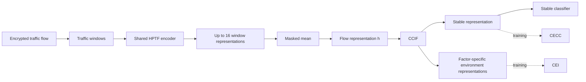

# DIFTER

Disentangle, Align, and Intervene for Source-Only Cross-Environment Encrypted Traffic Classification

## Overview

Encrypted-traffic classifiers can exploit environment-specific transport patterns and degrade under unseen capture conditions. DIFTER addresses source-only cross-environment classification through class-conditional factorization, cross-environment class-conditional alignment, and representation-level environment intervention. HPTF is the shared traffic backbone; the three method components are CCIF, CECC, and CEI.

## Method

### CCIF

Class-Conditional Invariant Factorization maps each 768-dimensional flow representation to a 256-dimensional stable representation and one 128-dimensional representation per observed source-environment factor. The classifier reads only the stable representation. A class-conditional finite-sample HSIC surrogate, environment prediction, cross-covariance, and reconstruction regularize the factorization; this is not an identifiability or strict-independence proof.

### CECC

Cross-Environment Class-Conditional Contrast projects stable representations to a normalized 128-dimensional space. Positives share the class and differ in source environment; negatives differ in class; same-class, same-environment pairs are ignored. No hard-negative mining or weighting is used.

### CEI

Compositional Environment Intervention operates in representation space. Each factor uses a detached same-class donor with a different source-environment value. The anchor stable representation and donor environment representations are reconstructed, factorized again, and constrained by classification, semantic, and environment-recovery losses. A single-factor task naturally reduces to a single-factor intervention.

## Architecture



Here `K <= 16` means at most 16 traffic-window representation units per flow, not 16 packets. Inference follows only `traffic -> HPTF -> masked mean -> stable representation -> classifier`.

## Installation

```bash
conda env create -f environment.yml
conda activate difter
```

or:

```bash
python -m pip install -r requirements.txt
```

## Data preparation

Processed datasets are not redistributed in this repository. Prepare source-train, source-validation, source-test, and target-test TSV files following [the data contract](docs/DATA_FORMAT.md). The included example contains only a header.

```bash
python scripts/preprocess.py --config configs/example_dataset.yaml
```

## Training

```bash
python scripts/train.py --config configs/difter.yaml --dataset-config configs/example_dataset.yaml
```

Training fits only source-train data. Checkpoint selection uses source-validation Macro-F1. Tokenizers, preprocessing statistics, normalization, hyperparameters, and checkpoint selection must not depend on target data.

## Evaluation

```bash
python scripts/evaluate.py --config configs/difter.yaml --dataset-config configs/example_dataset.yaml --split source_test --checkpoint checkpoints/best.pt
python scripts/evaluate.py --config configs/difter.yaml --dataset-config configs/example_dataset.yaml --split target_test --checkpoint checkpoints/best.pt
```

Target evaluation is final evaluation only and must reuse the source-validation-selected checkpoint.

## Inference

```bash
python scripts/infer.py --config configs/difter.yaml --input path/to/processed_windows.tsv --checkpoint checkpoints/best.pt
```

## Reproducibility

The default configuration fixes seed 42, at most 16 windows per flow, 6000 successful optimizer steps, evaluation every 250 steps, and the progressive optimization schedule described in [REPRODUCIBILITY.md](docs/REPRODUCIBILITY.md).

## Results

Results will be added after the experimental tables are finalized.

## Citation

Citation information will be updated upon publication.
