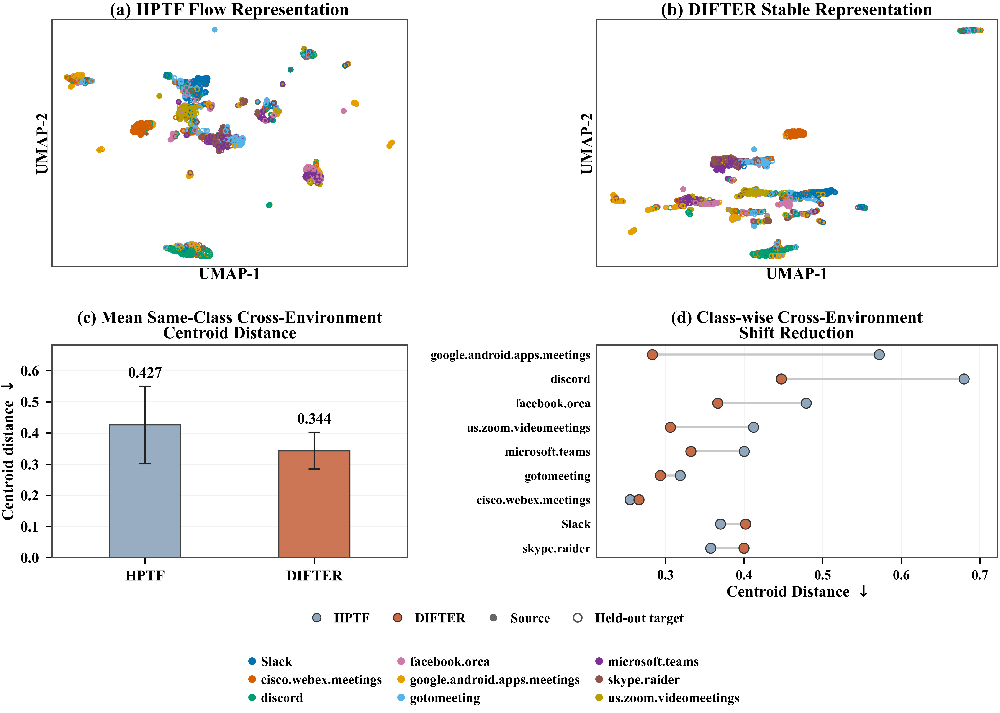

# DIFTER

**Disentangle, Align, and Intervene for Source-Only Cross-Environment Encrypted Traffic Classification**

PyTorch implementation of DIFTER for source-only cross-environment encrypted traffic classification.

## Overview

Encrypted traffic distributions can change across capture times, devices, and application contexts, shifting packet timing, packet-size patterns, and flow behavior. DIFTER learns transferable traffic representations through Class-Conditional Invariant Factorization (CCIF), Cross-Environment Class-Conditional Contrast (CECC), and Compositional Environment Intervention (CEI). Target samples are not used for representation learning or model selection.

The data path is: **Traffic Flow -> Traffic Windows -> HPTF Encoder -> K <= 16 Window Representations -> Masked Mean Aggregation -> CCIF -> CECC / CEI during training -> Stable Classifier**. Here, `K <= 16` refers to traffic windows per flow, not packets.

<p align="center">
  
</p>

<p align="center">
  <b>Overview of the DIFTER framework.</b>
</p>

## Highlights

- **CCIF** disentangles a flow representation into a class-stable component and factor-specific environmental components.
- **CECC** aligns same-class stable representations across different source environments.
- **CEI** recombines source-observed environmental factors from same-class donors to regularize unseen factor compositions.

At inference time, DIFTER retains only the HPTF encoder, masked window aggregation, stable projector, and classifier.

## Datasets

| Dataset | Classes | Flows | Distribution shift | Source -> Target |
| --- | ---: | ---: | --- | --- |
| APP53-Time | 27 | 8,908 | Temporal | Jun. 20--24 -> Jul. 19--23 |
| MIRAGE-2019 | 20 | 116,438 | Device | Device A+B -> Device C |
| MIRAGE-COVID | 9 | 39,837 | Device/activity composition | 10 observed compositions -> held-out composition |

## Main Results

The table reports Macro-F1 on the source-test split and the held-out target environment. Every checkpoint is selected exclusively by source-validation Macro-F1. The three benchmarks evaluate temporal transfer (APP53-Time), device transfer (MIRAGE-2019), and transfer to an unseen device--activity composition (MIRAGE-COVID).

| Model | APP53 Source | APP53 Target | MIRAGE-2019 Source | MIRAGE-2019 Target | MIRAGE-COVID Source | MIRAGE-COVID Target |
| --- | ---: | ---: | ---: | ---: | ---: | ---: |
| Random Forest | 0.4174 | 0.2668 | 0.7161 | 0.6672 | 0.7047 | 0.6400 |
| 1D-CNN | 0.1003 | 0.0745 | 0.6262 | 0.5952 | 0.6556 | 0.6082 |
| BiLSTM | 0.1084 | 0.0827 | 0.6594 | 0.6028 | 0.6401 | 0.5956 |
| Vanilla Transformer | 0.0825 | 0.0648 | 0.6484 | 0.5957 | 0.6322 | 0.5895 |
| ET-BERT | 0.4067 | 0.2309 | 0.7601 | 0.7088 | 0.7129 | 0.6496 |
| TrafficFormer | 0.2071 | 0.1194 | 0.7462 | 0.6925 | 0.7124 | 0.6538 |
| HPTF | 0.4845 | 0.2725 | 0.6435 | 0.6077 | 0.6429 | 0.6072 |
| **DIFTER** | **0.5045** | **0.2839** | **0.7163** | **0.7127** | **0.6618** | **0.6616** |

DIFTER yields the highest target Macro-F1 on all three shifts, reaching 0.2839 on APP53-Time, 0.7127 on MIRAGE-2019, and 0.6616 on MIRAGE-COVID. Relative to the shared HPTF backbone, these results correspond to absolute target gains of 1.14, 10.50, and 5.44 percentage points, respectively. The corrected APP53-Time ET-BERT entry uses its native datagram-bigram input pipeline and replaces the previously invalid collapsed run.

### Same-backbone DG comparison

All methods use the same HPTF backbone, traffic representation, source split, and source-validation model-selection protocol.

| Method | Source F1 | Mean Target F1 | Worst Target F1 |
| --- | ---: | ---: | ---: |
| HPTF-ERM | 0.6429 | 0.6244 | 0.6072 |
| HPTF-CORAL | 0.6454 | 0.6310 | 0.6028 |
| HPTF-GroupDRO | 0.6304 | 0.6068 | 0.5891 |
| HPTF-VREx | 0.5784 | 0.5614 | 0.5442 |
| HPTF-Fishr | 0.6314 | 0.6229 | 0.6068 |
| **DIFTER** | **0.6618** | **0.6428** | **0.6239** |

### Ablation study

The controlled MIRAGE-COVID ablation keeps the backbone, data split, seed, optimization budget, and source-validation checkpoint rule fixed. Mean target Macro-F1 averages the two held-out device--activity compositions.

| Method | CCIF | CECC | CEI | Mean F1 | Delta vs. Base |
| --- | :---: | :---: | :---: | ---: | ---: |
| HPTF Base | - | - | - | 0.6244 | - |
| + CCIF | ✓ | - | - | 0.6272 | +0.0028 |
| + CCIF + CECC | ✓ | ✓ | - | 0.6287 | +0.0043 |
| + CCIF + CEI | ✓ | - | ✓ | 0.6411 | +0.0167 |
| **DIFTER** | ✓ | ✓ | ✓ | **0.6428** | **+0.0184** |

CCIF alone provides a modest improvement over HPTF, and adding CECC raises the mean target score to 0.6287. The larger increase obtained by the CCIF+CEI variant indicates that compositional intervention contributes most of the observed ablation gain in this setting. Combining all three components produces the best mean target Macro-F1, 0.6428, an absolute improvement of 1.84 percentage points over HPTF Base.

### Representation analysis

<p align="center">
  
</p>

<p align="center">
  <b>HPTF and DIFTER representations on MIRAGE-COVID.</b>
</p>

Panels (a) and (b) visualize the HPTF flow representation and the DIFTER stable representation under the same source/held-out-target sampling contract. Panel (c) shows that the mean same-class cross-environment centroid distance decreases from 0.427 for HPTF to 0.344 for DIFTER. Panel (d) resolves this aggregate change by class: the largest reductions occur for Google Meet and Discord, while a small number of classes do not improve. The evidence therefore supports an overall reduction in class-conditional cross-environment shift rather than a claim of uniform contraction for every class. UMAP is used only for qualitative visualization; the centroid-distance comparisons are computed in the original normalized representation space.

## Method

### CCIF

CCIF separates each flow representation into a class-stable component and factor-specific environmental components. The classifier operates on the stable component.

### CECC

CECC aligns stable representations from the same class across different source environments while separating different classes.

### CEI

CEI recombines source-observed environmental factors from same-class donors in representation space, encouraging robustness to unseen factor compositions.

See [Method details](docs/METHOD.md) for the mathematical formulation and training objectives.

## Installation

```bash
conda env create -f environment.yml
conda activate difter
```

or:

```bash
pip install -r requirements.txt
```

## Data Preparation

DIFTER expects flow-level traffic samples to be converted into traffic windows containing traffic tokens, packet timing, packet length, and packet-boundary information.

The repository does not redistribute the benchmark datasets. Prepare the datasets according to [the data format](docs/DATA_FORMAT.md).

```bash
python scripts/preprocess.py --config configs/example_dataset.yaml
```

## Training

```bash
python scripts/train.py \
    --config configs/difter.yaml \
    --dataset-config configs/example_dataset.yaml
```

Model selection is based on source-validation Macro-F1; target data are reserved for final evaluation.

## Evaluation

```bash
python scripts/evaluate.py --config configs/difter.yaml --dataset-config configs/example_dataset.yaml --split source_test --checkpoint checkpoints/best.pt
python scripts/evaluate.py --config configs/difter.yaml --dataset-config configs/example_dataset.yaml --split target_test --checkpoint checkpoints/best.pt
```

The same source-selected checkpoint is used for source-test and target evaluation.

## Inference

```bash
python scripts/infer.py --config configs/difter.yaml --dataset-config configs/example_dataset.yaml --input path/to/processed_windows.tsv --checkpoint checkpoints/best.pt
```

Inference retains HPTF, masked window aggregation, the stable projector, and the classifier.

## Project Structure

```text
DIFTER/
├── assets/          # Framework figure
├── configs/         # Model and dataset configurations
├── data/            # Dataset schema and placeholders
├── difter/
│   ├── data/        # Data loading and traffic-window construction
│   ├── models/      # HPTF, CCIF, CECC, CEI, classifier
│   ├── losses/      # Training objectives
│   ├── training/    # Training and scheduling
│   └── evaluation/  # Metrics and evaluation
├── docs/            # Method, data format, reproducibility
├── scripts/         # Training/evaluation/inference entry points
└── tests/           # Unit tests
```

For deterministic setup and configuration details, see [Reproducibility](docs/REPRODUCIBILITY.md).

## Citation

If you find this repository useful, please cite the paper. Citation metadata will be updated upon publication; the current software record is available in [`CITATION.cff`](CITATION.cff).
